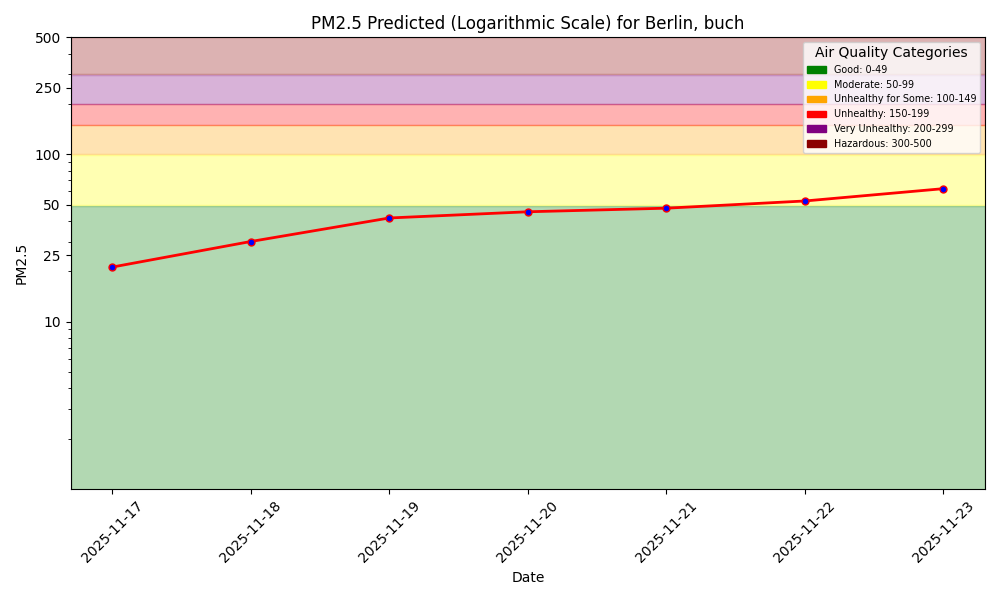

# Air Quality Dashboard



(./assets/img/pm25_forecast_friedrichshagen.png)
(./assets/img/pm25_forecast_karl-liebknecht-strasse.png)
(./assets/img/pm25_forecast_karl-marx-strasse.png)
(./assets/img/pm25_forecast_leipziger-strasse.png)
(./assets/img/pm25_forecast_mariendorf--mariendorfer-damm.png)
(./assets/img/pm25_forecast_mitte--bruckenstrasse.png)
(./assets/img/pm25_forecast_neukolln-nansenstrasse.png)
(./assets/img/pm25_forecast_neukolln-silbersteinstrasse.png)
(./assets/img/pm25_forecast_wedding-amrumer-strasse.png)

# Model Performance Monitoring

1-Day Hindcast: Predictions vs Outcomes

![Hindcast]
(./assets/img/pm25_hindcast_1day_buch.png)
(./assets/img/pm25_hindcast_1day_friedrichshagen.png)
(./assets/img/pm25_hindcast_1day_karl-liebknecht-strasse.png)
(./assets/img/pm25_hindcast_1day_karl-marx-strasse.png)
(./assets/img/pm25_hindcast_1day_leipziger-strasse.png)
(./assets/img/pm25_hindcast_1day_mariendorf--mariendorfer-damm.png)
(./assets/img/pm25_hindcast_1day_mitte--bruckenstrasse.png)
(./assets/img/pm25_hindcast_1day_neukolln-nansenstrasse.png)
(./assets/img/pm25_hindcast_1day_neukolln-silbersteinstrasse.png)
(./assets/img/pm25_hindcast_1day_wedding-amrumer-strasse.png)
